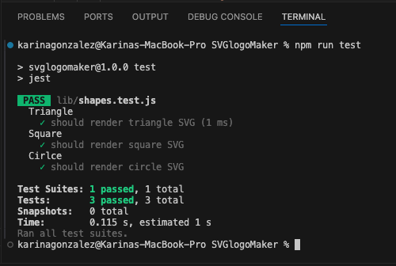

# SVGlogoMaker

## Description

This project creates a simple logo for projects. It is intented to help make projects better by adding a logo for any freelance work and helps the web developer so that we don't need to hire a graphic designer for a simple logo.
This logo can enhance any project and make it look more professional. This logo maker is also great for working on a projec within a budget. By not having to find a graphic designer and paying for a simple logo, it can save time and money.

Creating this project has helped me understand SVG and JEST. Testing out parts of the code to ensure it will work is important to save time in the long run. 
Testing out small parts can prevent issues down the road and can help fix any issues along the way.

## Table of Contents

- [Installation](#installation)
- [Usage](#usage)
- [Tests](#tests)

## Installation

Clone the repository

Install the following:

Node.JS Version 16.18.1
Jest Version 29.4.3
Inquirer.js: Version 8.2.4

## Usage

Open the cloned repository in Visual Studio Code.

Open integrated terminal on index.js

Enter “node index.js” in the command line

The user will be presented with npm inquirer questions - the user will provide a response to each question and proceed.

Once completed a SVG file named "logo.svg" will be created.

At your discretion, you may rename the "logo.svg" file to the file name of your choice.

Walkthrough video link: https://drive.google.com/file/d/1u-CopDKLHwmv4weEDXA0nZC2vXIR36PT/view?usp=sharing

## Tests

In the terminal command line, enter "npm run test". The test set up using Jest should all pass and look similar to the image below. 

